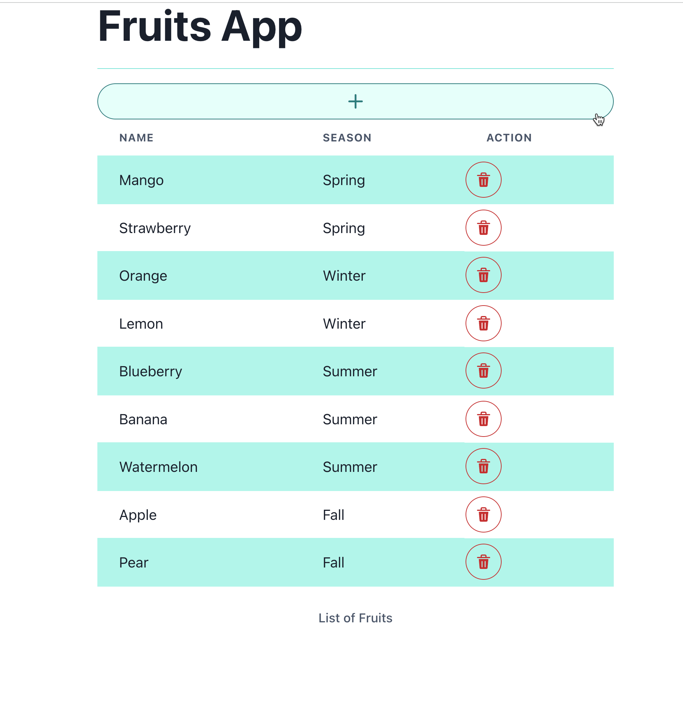

# Fruits Demo

A Drone pipeline JAR(Java And Reactive) stack to show build, test and deploy a [Java](https://jdk.java.net/) API with [React](https://reactjs.org/) Frontend with optional DB.

The stack has the following components,

- A [Quarkus](https://quarkus.io) based Java REST API with optional persistence using Hibernate
- An React based UI application

## Pre-requisites

- [Docker Desktop for Mac/Windows](https://www.docker.com/products/docker-desktop/) and Docker on Linux

- Drone Desktop Extension,

  ```shell
   docker volume create drone-desktop-data
   docker extension install kameshsampath/drone-desktop-extension:v1.1.2
  ```

## Clone Sources

```shell
git clone htps://github.com/kameshsampath/drone-fruits-app-demo
cd drone-fruits-app-demo
export DEMO_HOME="$PWD"
```

__NOTE__: The demo sources that we cloned will be referred to as `$DEMO_HOME`

## Set Environment

### Secret File

Create the secret file

```shell
cp $DEMO_HOME/secret.example $DEMO_HOME/my.secret
```

Edit the `my.secret` and update the value to suit your environment and settings.

```shell
export SECRET_FILE=$DEMO_HOME/my.secret
```

### Environment file

Create the secret file

```shell
cp $DEMO_HOME/.env.example $DEMO_HOME/.env
```

Edit the `.env` and update the value to suit your environment and settings.

```shell
export ENV_FILE=.env
```

Ensure the environment variables set in the current shell,

```shell
source $ENV_FILE
```

## Build and Deploy

### Docker Compose

Start the local registry,

```shell
$DEMO_HOME/hack/registry.sh
```

```shell
export DOCKER_NETWORK=kind
ln -s $DEMO_HOME/.drone.compose.yml .drone.yml
```

Once the pipeline completes you should see `fruits-api` and `fruits-ui` services started. Use the Docker Desktop to access the service. Use the `fruits-ui` service to access the service via browser.

### Kubernetes

We can use kind as target Kubernetes cluster that can be used by our pipeline,

Start Kind Cluster

```shell
$DEMO_HOME/hack/kind.sh
```

```shell
export DOCKER_NETWORK=kind
ln -s $DEMO_HOME/.drone.kind.yml .drone.yml
```

As local docker registry will be used to push the images. Refer to [Kind document](https://kind.sigs.k8s.io/docs/user/local-registry/) for more details.

Update the secrets file `my.secret` for API and UI image name as shown below:

```shell
api_image=kind-registry:5000/example/fruits-api
ui_image=kind-registry:5000/example/fruits-ui
```

Run the pipeline

```shell
drone exec --env-file="${ENV_FILE}" --secret-file="${SECRET_FILE}" --network="${DOCKER_NETWORK}" --trusted
```

__NOTE__: The drone commands are given for understanding, when using Drone Desktop Docker extension it takes care of running these commands for you.

Once the pipeline is successful do port-forward the Fruits UI service,open a new terminal and run the following command:

```shell
kubectl port-forward -n $APP_NAMESPACE services/fruits-ui 3000:3000
```

Open the service on the url <http://localhost:3000>. If all went well you should see the Application UI as shown,



## Deploy Google Cloud

### Pre-requisites

- [Google Cloud](https://cloud.google.com/) Service Account(SA) with permissions to,
  - Ability to deploy to [Google Cloud Run](https://cloud.google.com/run)
  - Ability to push to [Google Cloud Registry](https://cloud.google.com/container-registry/)
  
- Optionally [gcloud CLI](https://cloud.google.com/cli)

This section will demonstrate on how to use the drone pipeline to deploy the API on to Google Cloud Run and the frontend UI to [vercel](https://vercel.com)

__WARNING__: The following section is __WIP__

```shell
ln -s $DEMO_HOME/.drone.gcloud.yml .drone.yml
```

__IMPORTANT__: Make sure you have updated all the GCP related parameters in your secret before you run the pipeline

Run the pipeline

```shell
drone exec --env-file="${ENV_FILE}" --secret-file="${SECRET_FILE}" --trusted
```

### API Access

#### Make Service publicly accessible

As the API is not enabled with authentication by default to quickly test the application try allowing `allUsers` to access the API,

```shell
gcloud run services add-iam-policy-binding fruits-api \
  --region="${GCP_REGION}" \
  --member="allUsers" \
  --role="roles/run.invoker"
```

#### Disable Public Access to API

To switch back to authentication mode use the following command,

```shell
gcloud run services remove-iam-policy-binding fruits-api --member='allUsers' --role='roles/run.invoker' --region="${GCP_REGION}"
```
